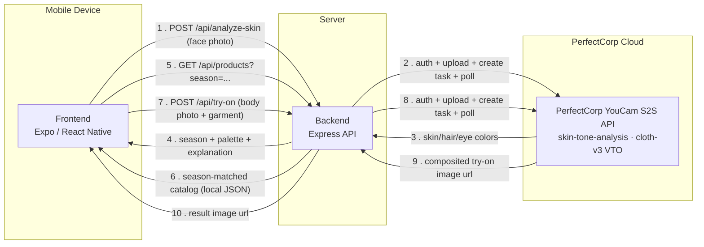

# Hue.U

**Hue.U** turns a single selfie into a personal color profile — undertone, seasonal palette, and outfit recommendations — then lets the user virtually try those outfits on with a full-body photo. Built for the **YouCam (PerfectCorp) API hackathon**, it pairs PerfectCorp's skin-tone-analysis and virtual-try-on AI endpoints with a small local color-theory engine (CIELAB-based undertone + contrast classification) and a curated, season-tagged product catalog.


---

## Contents

- **[Backend API Docs](backend/README.md)** — Express API, PerfectCorp integration, color-logic engine, endpoint reference, environment variables, setup, and tests.
- **[Frontend App Docs](frontend/README.md)** — Expo/React Native client, screen-by-screen reference, navigation & sequence diagrams, environment variables, and setup (including physical-device LAN notes).

---

## How it fits together



The backend is the only thing that talks to PerfectCorp — it owns auth (short-lived RSA-signed access tokens), file uploads to presigned S3 URLs, task creation, and bounded polling for both async AI tasks. The frontend never calls PerfectCorp directly; it only calls the three backend endpoints above and renders what comes back.

---

## Tech Stack

| Layer | Tool | Version |
|-------|------|---------|
| Backend runtime | Node.js | — |
| Backend framework | Express | 5.x |
| Backend HTTP client | Axios | 1.x |
| Backend uploads | Multer | 2.x |
| Backend tests | `node:test` (built-in) | — |
| Frontend runtime | Expo | ~57.0.8 |
| Frontend framework | React Native | 0.86.0 |
| Frontend UI | React | 19.2.3 |
| Frontend navigation | React Navigation (stack) | 7.x |
| Frontend HTTP client | Axios | 1.x |
| External AI | PerfectCorp YouCam S2S API | skin-tone-analysis, cloth-v3 VTO |

Full per-layer breakdowns live in [backend/README.md](backend/README.md#tech-stack) and [frontend/README.md](frontend/README.md#tech-stack).

---

## Project Structure

```
hue.u/
├── README.md            # This file — project index
├── backend/              # Express API + PerfectCorp integration + color logic
│   ├── server.js
│   ├── src/
│   │   ├── app.js
│   │   ├── config/
│   │   ├── routes/
│   │   ├── controllers/
│   │   ├── services/
│   │   │   ├── perfectCorp/
│   │   │   └── colorLogic/
│   │   ├── utils/
│   │   ├── middleware/
│   │   └── data/
│   ├── tests/
│   └── README.md
└── frontend/             # Expo / React Native client
    ├── App.js
    ├── src/
    │   ├── navigation/
    │   ├── screens/
    │   ├── components/
    │   ├── hooks/
    │   ├── services/
    │   ├── context/
    │   └── constants/
    └── README.md
```

---

## Getting Started

```bash
git clone <this-repo-url>
cd hue.u
```

From here, set up each side independently:

1. **Backend** — see [backend/README.md § Setup / Getting Started](backend/README.md#setup--getting-started) for installing dependencies, configuring PerfectCorp credentials in `.env`, and running the API server.
2. **Frontend** — see [frontend/README.md § Setup / Getting Started](frontend/README.md#setup--getting-started) for installing dependencies, pointing `EXPO_PUBLIC_API_URL` at your running backend (including the LAN-IP note for physical devices), and launching the Expo app.

The backend must be running and reachable before the frontend can complete any of its three API calls (`analyze-skin`, `products`, `try-on`).

---

## Known Limitations

- **Product images are placeholders.** Every entry in `backend/src/data/products.json` has an `image_url` pointing at `cdn.hue-u.example/...`, which does not resolve to a real image. These need to be replaced with real, hosted garment images before virtual try-on can work end-to-end against the catalog — PerfectCorp's VTO endpoint needs a fetchable `ref_image_url`.
- **File-id chaining is unused end-to-end.** The backend supports reusing a previously uploaded/generated file (`src_file_id` / `ref_file_id` / `dst_id`) to skip a re-upload, but the frontend always uploads fresh images for both skin analysis and try-on. Note that the skin-analysis photo (face) and try-on photo (full body) are different images by design, so chaining is only meaningful for reusing the *same* full-body photo across multiple try-ons in one session — not yet wired up.
- **Polling is bounded (~80s server-side, 90s client-side timeout).** A genuinely slow PerfectCorp task fails as a timeout rather than continuing in the background; there's no async/webhook/push-notification pattern.
- **No persistence.** Analysis results and the product catalog are in-memory/file-based on the backend, and per-session-only (React Context) on the frontend — nothing survives an app restart or server restart.
- **No automated tests on the frontend.** The backend has a `node:test` suite over its pure color-logic functions; the frontend has none.

See each README's own "Known Limitations" section for more detail: [backend](backend/README.md#known-limitations--todo), [frontend](frontend/README.md#known-limitations).
