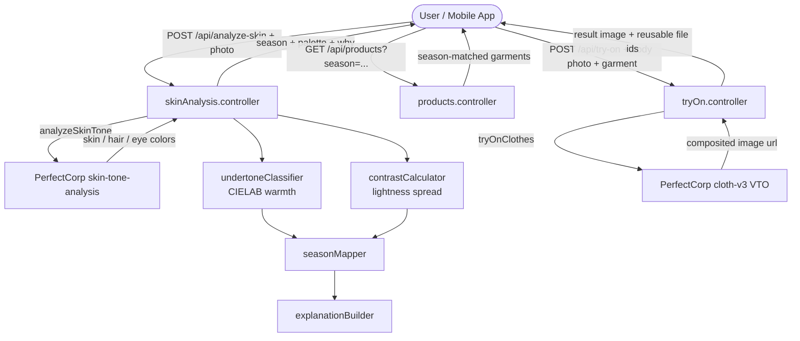
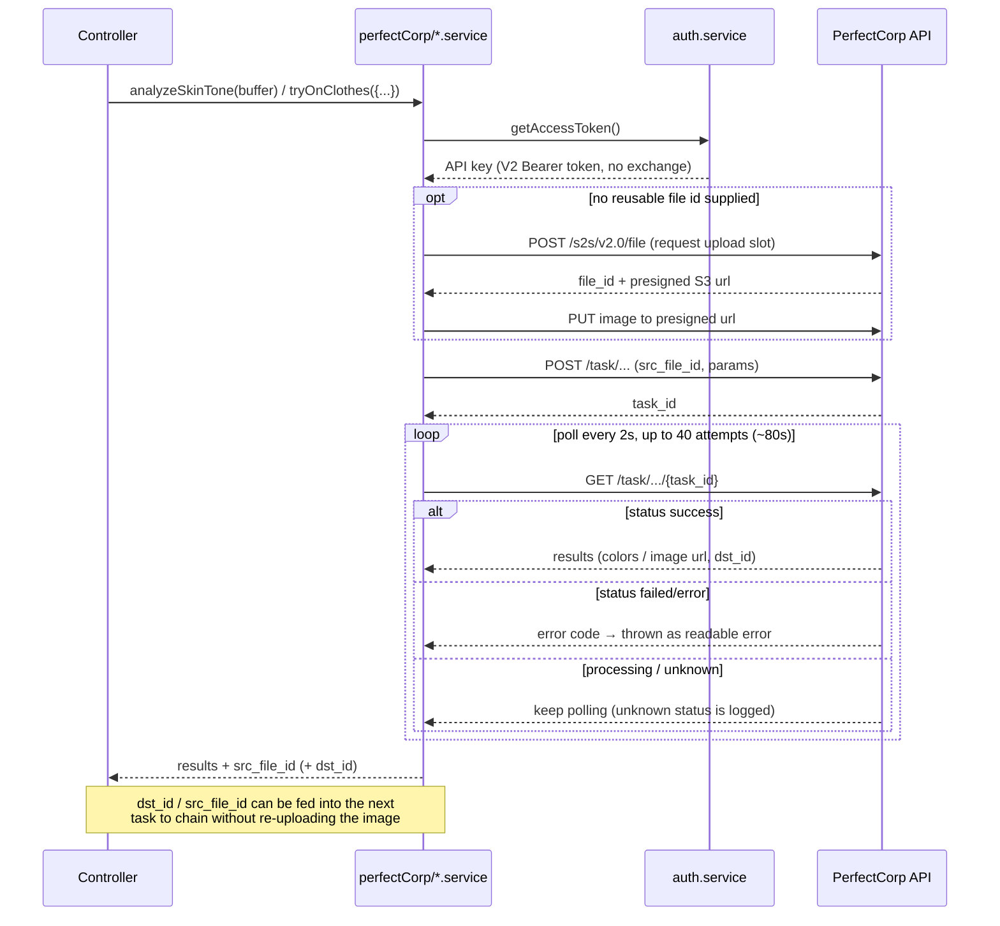
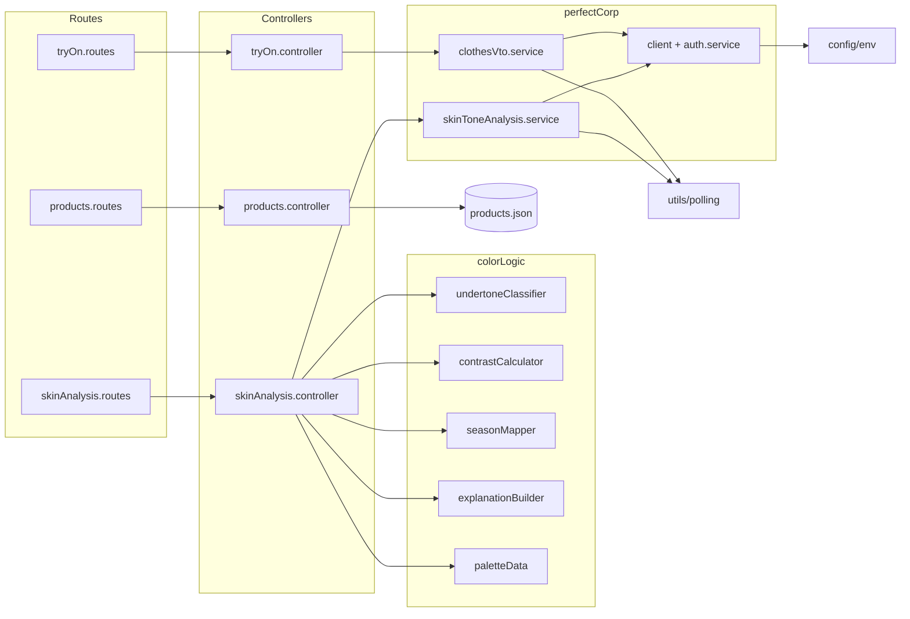

# Hue.U Backend

Backend for **Hue.U**, a skin-tone analysis and outfit-recommendation app built for the YouCam (PerfectCorp) API hackathon. It turns a single selfie into a personal color profile — undertone, seasonal palette, and product recommendations — and drives a virtual try-on of those garments.


---

## Overview

The backend orchestrates three things: PerfectCorp's AI vision endpoints, a local color-theory engine, and a curated product catalog.

**End-to-end flow**

1. A user uploads a face photo.
2. The photo is sent to PerfectCorp's **skin-tone-analysis** task, which returns dominant skin / hair / eye colors.
3. Local color logic classifies the **undertone** (CIELAB warmth axis), measures feature **contrast**, and maps the pair to one of four **seasons** (spring / summer / autumn / winter), plus a human-readable "why".
4. The season is used to filter a curated **product catalog**.
5. The user picks a garment and runs a **virtual try-on** (PerfectCorp `cloth-v3`), which composites the garment onto their body photo.

**Why async polling?** PerfectCorp's vision endpoints are asynchronous: you create a *task*, then poll its status until it succeeds or fails. There is no synchronous "analyze and return" call, so the backend wraps each task in a bounded polling loop (see [`utils/polling.js`](src/utils/polling.js)). File uploads use short-lived presigned S3 URLs, and auth uses the PerfectCorp **V2 scheme**: the API key is sent directly as a Bearer token on every request (no token exchange or RSA signing).

---

## Architecture & Flow

### 1. End-to-end request flow



### 2. PerfectCorp task lifecycle (auth → upload → task → poll → chain)



### 3. Module dependency



---

## Tech Stack

| Tool | Version | Role in this project |
|------|---------|----------------------|
| **Node.js** | runtime | Runs the server; uses the built-in `node:test` runner for the color-logic tests. |
| **Express** | 5.x | HTTP server, routing, JSON body parsing, error middleware. |
| **Axios** | 1.x | HTTP client for all PerfectCorp calls (auth, file upload, task create, polling) and S3 presigned uploads. |
| **Multer** | 2.x | Multipart/form-data handling for image uploads; uses in-memory storage and an image-only filter (10 MB cap). |
| **CORS** | 2.x | Allows the Expo/React Native frontend to call the API cross-origin. |
| **dotenv** | 17.x | Loads PerfectCorp credentials and config from `.env`. |
| **node:test + node:assert** | built-in | Unit tests for the pure color-logic functions — no external test framework. |

---

## Folder Structure

```
backend/
├── server.js               # Entry point: validates env, then starts the HTTP server
├── package.json
├── .env.example            # Template for required environment variables
└── src/
    ├── app.js              # Express app: middleware + route mounting + /health
    ├── config/
    │   └── env.js          # Loads .env and fail-fast validation of required vars
    ├── routes/             # Thin route definitions per resource
    ├── controllers/        # Request handling: analyze-skin, products, try-on
    ├── services/
    │   ├── perfectCorp/    # PerfectCorp integration (auth, client, tasks)
    │   └── colorLogic/     # Local color theory: undertone, contrast, season, palette
    ├── utils/              # Task polling, S3 upload, error handling
    ├── middleware/         # Multer upload config + error middleware
    └── data/
        └── products.json   # Curated season-tagged product catalog
```

---

## API Endpoints

Base path: `/api`

### `POST /api/analyze-skin`
Analyze a face photo and return the color profile.

- **Body:** `multipart/form-data` with field `image` (a face photo).
- **Response:**
```json
{
  "status": "success",
  "data": {
    "analysis": {
      "skin_color": "#E0AC69", "hair_color": "#3B2A1A", "eye_color": "#5A4632",
      "src_file_id": "...", "dst_id": "..."
    },
    "classification": { "undertone": "warm", "contrast": "high", "season": "spring" },
    "recommendations": {
      "palette": [ { "name": "Coral", "hex": "#FF7F50" }, "..." ],
      "explanation": "Your warm, golden undertones and high contrast ... place you in the Spring palette ..."
    }
  }
}
```
The returned `src_file_id` / `dst_id` can be passed to `/api/try-on` to skip re-uploading the same photo.

### `GET /api/products`
Return the product catalog, optionally filtered by season.

- **Query:** `season` (optional) — one of `spring | summer | autumn | winter`. Omit to get all products. An invalid season returns `400`.
- **Response:** `{ "status": "success", "data": [ /* products */ ] }`

### `POST /api/try-on`
Composite a garment onto a body photo via PerfectCorp VTO.

- **Body:** `multipart/form-data`:
  - `src_image` *(file)* **or** `src_file_id` *(text)* — the model/body photo, uploaded fresh or reused from a prior task.
  - `ref_image` *(file)* **or** `ref_file_id` *(text)* **or** `ref_image_url` *(text)* — the garment reference.
  - `garment_category` — `full_body | upper_body | lower_body` (defaults to `full_body`).
- **Response:** `{ "status": "success", "data": { "url": "<result image>", "dst_id": "...", "src_file_id": "..." } }`

### `GET /health`
Liveness check → `{ "status": "ok" }`.

---

## Environment Variables

Defined and validated in [`src/config/env.js`](src/config/env.js). Copy `.env.example` to `.env` and fill in your PerfectCorp credentials. **Never commit real keys** — `.env` is gitignored; only `.env.example` is tracked.

| Variable | Required | Description |
|----------|:--------:|-------------|
| `PERFECTCORP_API_KEY` | ✅ | PerfectCorp/YouCam **V2 API key**, sent as `Authorization: Bearer <key>` on every request. Generate one at the [YouCam API console](https://yce.makeupar.com/api-console/en/api-keys/). Server refuses to start if missing. |
| `PERFECTCORP_BASE_URL` | ⬜ | API base URL. Defaults to `https://yce-api-01.makeupar.com`. |
| `PORT` | ⬜ | HTTP port. Defaults to `5000`. |

`server.js` calls `validateEnv()` before binding the port, so a missing key fails fast with a clear message instead of a confusing `401` on the first request.

---

## Data Model

`src/data/products.json` holds a curated catalog of **16 products, 4 per season**, each tagged with a structured `season` field so recommendations are an exact match rather than a fuzzy substring search on free text.

```json
{
  "id": 1,
  "name": "Coral Linen Shirt",
  "season": "spring",
  "color_name": "Coral",
  "color_hex": "#FF7F50",
  "price": 32.0,
  "currency": "USD",
  "garment_category": "upper_body",
  "image_url": "https://cdn.hue-u.example/products/coral-linen-shirt.jpg"
}
```

| Field | Meaning |
|-------|---------|
| `season` | Season the garment belongs to — the filter key for `/api/products`. |
| `color_name` / `color_hex` | Human name and hex, drawn from the season's palette. |
| `price` / `currency` | Display price. |
| `garment_category` | Maps to the VTO `garment_category` (`upper_body` / `lower_body` / `full_body`). |
| `image_url` | Garment reference image (fed to VTO as `ref_image_url`). |

The seasonal palettes themselves live in `src/services/colorLogic/paletteData.js` (8 named colors per season), returned as the `recommendations.palette`.

---

## Color Logic Explanation

The classification pipeline is a chain of small, pure functions in `src/services/colorLogic/`:

**1. Undertone — `undertoneClassifier.js` (CIELAB).**
PerfectCorp's skin hex is converted sRGB → linear → XYZ → **CIELAB** (D65 white point). CIELAB separates lightness (`L*`) from the red–green (`a*`) and blue–yellow (`b*`) opponent axes. Undertone is decided on a **warmth axis** `warmth = b* − a*`:
- `warmth > 17` → **warm** (golden-yellow lead)
- `warmth < 7` → **cool** (pink lead)
- otherwise → **neutral**

This replaces a naive HSV-hue check, which clustered nearly every skin tone into one narrow orange band. Thresholds were calibrated against labelled warm/cool/neutral swatches.

**2. Contrast — `contrastCalculator.js`.**
Computes perceptual lightness (`0.299R + 0.587G + 0.114B`, scaled 0–100) for skin, hair, and eyes and takes the spread between the lightest and darkest feature. Spread `> 35` → **high** contrast, else **low**.

**3. Season — `seasonMapper.js`.**
Maps the `undertone × contrast` pair to a season:

| Undertone | High contrast | Low contrast |
|-----------|---------------|--------------|
| warm | spring | autumn |
| cool | winter | summer |
| neutral | spring | summer |

Neutral gets its own path (bright on high contrast, soft on low) rather than collapsing into cool.

**4. "Why" — `explanationBuilder.js`.**
Turns the `season / undertone / contrast` triple into one natural-language sentence (e.g. *"Your warm, golden undertones and high contrast … place you in the Spring palette …"*), so the API returns reasoning, not just a bare label.

---

## Testing

Uses Node's built-in test runner — no external framework.

```bash
npm test        # runs node --test over tests/
```

Covered (13 tests over the pure color-logic functions):

- **`undertoneClassifier.test.js`** — warm/cool/neutral swatch batches, hex with/without `#`, and CIELAB anchors (white ≈ `L*100`, black ≈ `L*0`).
- **`contrastCalculator.test.js`** — high vs low contrast and order-independence.
- **`seasonMapper.test.js`** — the full six-combination mapping table + neutral not collapsing onto the cool path.

---

## Setup / Getting Started

```bash
# 1. Install dependencies
cd backend
npm install

# 2. Configure environment
cp .env.example .env
#    then edit .env and add your PerfectCorp PERFECTCORP_API_KEY

# 3. Run
npm run dev     # node --watch server.js (auto-restart on change)
# or
npm start       # node server.js

# 4. (optional) run tests
npm test
```

The server logs `Server is running on port 5000` once up. Hit `GET /health` to confirm.

---

## Known Limitations / TODO

- **Product images are placeholders.** `image_url` values point at `cdn.hue-u.example/...` and are not real VTO-ready garment assets — swap in real hosted images before try-on works end-to-end with the catalog.
- **`dst_id` chaining is opt-in.** The try-on controller accepts `src_file_id` / `ref_file_id`, but the frontend currently still re-uploads; wiring the returned ids through the client is a follow-up.
- **Polling is bounded to ~80s**, kept under the frontend's 90s request timeout. Genuinely long VTO jobs would need an async/webhook pattern rather than in-request polling.
- **No persistence.** Analysis results and catalog are in-memory / file-based; there is no database.
