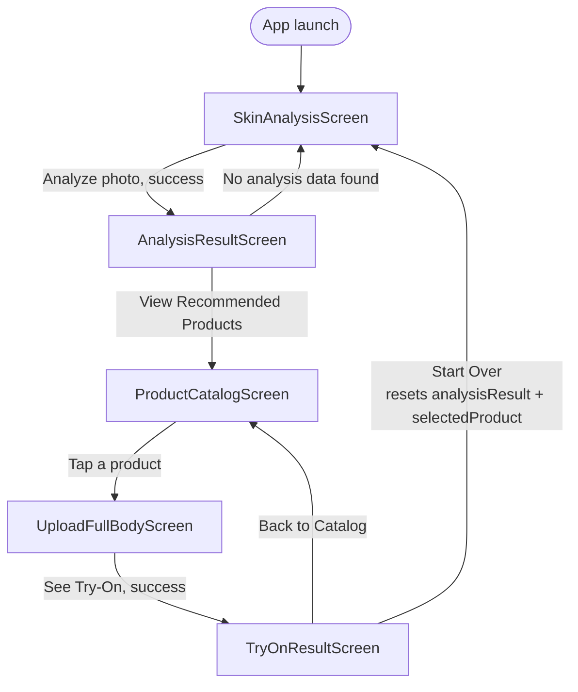
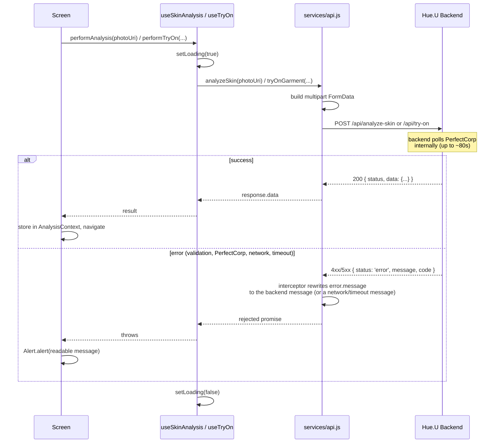

# Hue.U Frontend

Mobile client for **Hue.U**, a skin-tone analysis and outfit-recommendation app built for the YouCam (PerfectCorp) API hackathon. It walks a user from a single selfie to a personal color profile, a curated product catalog, and a virtual try-on of their picks.


---

## Overview

The app is a five-screen Expo/React Native stack that talks to the [Hue.U backend](../backend/README.md) for every piece of business logic — the client itself holds no color theory or catalog data, only UI state and API calls.

**End-to-end flow**

1. **Skin Analysis** — user picks a face photo (compressed/resized client-side), which is uploaded to `POST /api/analyze-skin`.
2. **Analysis Result** — the returned season, undertone, palette, and "why" explanation are displayed.
3. **Product Catalog** — `GET /api/products?season=...` is fetched using the season from step 2; user taps a product to try on.
4. **Upload Full Body** — user picks a full-body photo, which is composited with the chosen garment via `POST /api/try-on`.
5. **Try-On Result** — the composited image is shown, with options to go back to the catalog or start a brand-new analysis.

Analysis and product-selection state is shared across screens through a single React Context (`AnalysisContext`) rather than being re-fetched or passed manually through every navigation call.

---

## Architecture & Flow

### 1. Screen / navigation flow



### 2. Sequence: screen → hook → api.js → backend



---

## Tech Stack

| Tool | Version | Role in this project |
|------|---------|----------------------|
| **Expo** | ~57.0.8 | Managed React Native runtime, build tooling, and `expo-image-picker` / `expo-image-manipulator` modules. |
| **React Native** | 0.86.0 | Cross-platform mobile UI runtime. |
| **React** | 19.2.3 | Component model / hooks. |
| **@react-navigation/native + /stack** | 7.x | Stack-based screen navigation with a native header. |
| **Axios** | 1.x | HTTP client for all backend calls, with a shared instance, timeout, and error-normalizing interceptor. |
| **expo-image-picker** | ~57.0.6 | Camera-roll photo selection for both the face and full-body photos. |
| **expo-image-manipulator** | ~57.0.8 | Client-side resize/compress of the face photo before upload. |
| **react-native-safe-area-context / -screens** | 5.x / 4.x | Safe-area handling and native screen optimization required by React Navigation. |

---

## Folder Structure

```
frontend/
├── App.js                    # Root component: SafeAreaProvider > AnalysisProvider > AppNavigator
├── index.js                  # Expo entry point (registerRootComponent)
├── app.json                  # Expo app config (name, icons, platform settings)
├── package.json
└── src/
    ├── navigation/
    │   └── AppNavigator.js   # Stack navigator wiring all 5 screens
    ├── screens/               # One file per screen (see below)
    ├── components/            # Small reusable UI pieces
    ├── hooks/                 # API-call hooks with loading/error state
    ├── services/
    │   └── api.js             # Axios instance + one function per backend endpoint
    ├── context/
    │   └── AnalysisContext.js # Cross-screen state: analysisResult, selectedProduct
    └── constants/
        └── colors.js          # Shared color tokens used across screens/components
```

---

## Screens & Components

### Screens (`src/screens/`)

| Screen | Responsibility |
|--------|-----------------|
| **SkinAnalysisScreen** | Picks/compresses a face photo, calls `analyze-skin`, stores the result in context, navigates to `AnalysisResult`. Shows a full-screen `LoadingSpinner` while the request (including the backend's internal PerfectCorp polling) is in flight. |
| **AnalysisResultScreen** | Reads `analysisResult` from context and renders season, undertone, the backend's natural-language explanation, and the recommended color palette. Falls back to an empty state with a "Start a New Analysis" action if no result is in context. |
| **ProductCatalogScreen** | Fetches `GET /api/products` filtered by the analyzed season, and renders a two-column grid via `ProductCard`. Shows a loading spinner, an explicit error message on fetch failure, and an empty-state message when a season has no products. |
| **UploadFullBodyScreen** | Picks a full-body photo and calls `try-on` for the selected product, then navigates to the result screen with the composited image URL. Buttons are disabled while a request is in flight to prevent duplicate submissions. |
| **TryOnResultScreen** | Displays the composited try-on image (or a placeholder if none was returned). "Start Over" clears `analysisResult`/`selectedProduct` from context before returning to `SkinAnalysis`, so a new run doesn't inherit stale state. |

### Components (`src/components/`)

| Component | Responsibility |
|-----------|-----------------|
| **CameraGuideOverlay** | Non-interactive dashed frame + instructions overlaid on the face-photo preview to help users compose the shot. |
| **ColorSwatch** | A single circular color chip, used to render each palette entry. |
| **LoadingSpinner** | Full-screen translucent overlay with a spinner and message, used during the (potentially long) analyze-skin and try-on requests. |
| **ProductCard** | Product tile (image, name, price) used in the catalog grid; falls back to a placeholder image if `image_url` is missing. |

### Hooks (`src/hooks/`)

| Hook | Responsibility |
|------|-----------------|
| **useSkinAnalysis** | Wraps `analyzeSkin`, exposing `{ performAnalysis, loading }`. |
| **useTryOn** | Wraps `tryOnGarment`, exposing `{ performTryOn, loading, error }`. |

### Context (`src/context/AnalysisContext.js`)

Holds `analysisResult` (the full `analyze-skin` response) and `selectedProduct` (the catalog item chosen for try-on), shared across screens so they don't need to be threaded through navigation params.

---

## Environment Variables

The backend base URL is resolved in `src/services/api.js` in this order (first one set wins):

| # | Source | Required | Description |
|---|--------|:--------:|-------------|
| 1 | `EXPO_PUBLIC_API_URL` env var | ⬜ | Base URL (including `/api`) of the Hue.U backend, e.g. `http://192.168.1.23:5000/api`. Expo automatically inlines any `EXPO_PUBLIC_*` variable at build time — set it via a `.env` file at the `frontend/` root (picked up by Expo CLI) or by exporting it in your shell before running `expo start`. Intended for day-to-day local development. |
| 2 | `expo.extra.apiUrl` in `app.json` | ⬜ | Lets a **built app** point at a different backend (e.g. a staging/production deployment) purely by editing config — no source change or env var needed. Useful for a teammate demoing on a physical device from a build they didn't compile themselves. `null` by default (skipped). |
| 3 | hardcoded fallback | — | `http://10.0.2.2:5000/api`, which only resolves on the **Android emulator** (its alias for the host machine's `localhost`). |

Neither #1 nor #2 resolves automatically for iOS simulators, web, or a physical device — set one of them explicitly. See below for picking the right host.

---

## Setup / Getting Started

```bash
# 1. Install dependencies
cd frontend
npm install

# 2. Point the app at your backend (see table above)
echo "EXPO_PUBLIC_API_URL=http://<HOST>:5000/api" > .env

# 3. Run
npm start          # opens the Expo dev tools / QR code
npm run android     # launch on an Android emulator or connected device
npm run ios         # launch on an iOS simulator (macOS only)
npm run web          # run in a browser (limited: no native camera roll picker on some platforms)
```

### Choosing `<HOST>`

- **Android emulator:** use `10.0.2.2` (the default) — it's the emulator's alias for your machine's `localhost`.
- **iOS simulator:** use `localhost` or `127.0.0.1` — the simulator shares the host's network namespace.
- **Physical device (Expo Go or a dev build):** the device is on your Wi-Fi, not your machine, so `localhost` will not work. Use your computer's **LAN IP address** (e.g. `192.168.1.23`), found via `ipconfig getifaddr en0` (macOS), `ip addr` (Linux), or `ipconfig` (Windows). The phone and computer must be on the same network, and the backend must be reachable on that interface (Express listens on all interfaces by default, so no server-side change is usually needed — just confirm your firewall allows inbound connections on the backend port).

The backend itself must be running (`cd ../backend && npm run dev`) and reachable at the URL you configure, or every screen that calls the API will surface a "Network error" alert (see the error-handling notes below).

---

## Error Handling & Network Notes

- `services/api.js` uses a single shared Axios instance with a 90s timeout — kept just above the backend's own ~80s bounded polling budget for PerfectCorp tasks, so the client doesn't give up before the server does.
- A response interceptor normalizes every failure into a readable `error.message`: the backend's own `message` field on 4xx/5xx responses (e.g. *"Face not detected or position is invalid."*), a fixed timeout message, or a fixed network-error message when there's no response at all (server unreachable, no connectivity, wrong `EXPO_PUBLIC_API_URL`).
- Screens surface that message via `Alert.alert(...)`; `ProductCatalogScreen` renders it inline instead, since it isn't a user-initiated action.

---

## Known Limitations

- **Full-body photo is always re-uploaded.** The backend accepts `src_file_id`/`ref_file_id` to reuse a previously uploaded/generated image (see [backend README](../backend/README.md#known-limitations--todo)), but the client always uploads a fresh file for every try-on, even when trying multiple garments on the same body photo in one session.
- **No offline/queueing support.** A dropped connection mid-request simply fails with an alert; there's no retry queue or offline cache.
- **Web target (`npm run web`) is not a primary target.** `expo-image-picker`'s camera-roll flow and some styling assumptions are tuned for native (iOS/Android); the web build is best-effort.
- **No automated tests** for the frontend (unlike the backend's `node:test` suite over its color logic).
